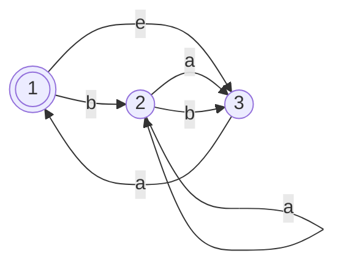
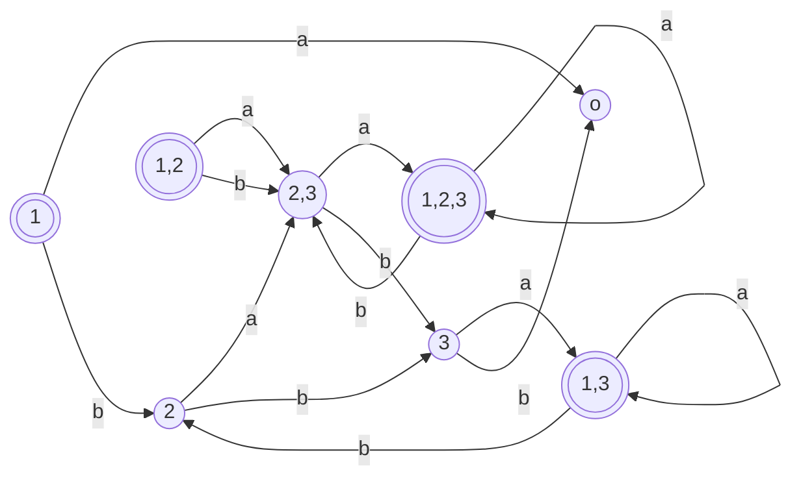

# Conversão de AFN para AFD

Todo AFN tem um AFD equivalente. Se $k$ é o número de estados do AFN, ele tem $2^k$ subconjuntos de estados
- Cada subconjunto corresponde a uma das possibilidades de que o AFD tem que se lembrar, portanto o AFD que simula o AFN terá $2^k$ estados.

### Exemplo:

AFN: $N = (Q,\{a,b\},\delta,1,\{1\})$

Primeiro determinamos os estados de $D$. $N$ tem três estados $\{1,2,3\}$, assim construímos $D$ com oito estados, um para cada subconjunto de $N$.

$\{\empty,\{1\},\{2\},\{3\},\{1,2\},\{1,3\},\{2,3\},\{1,2,3\}\}$

Em seguida o estado inicial e de aceitação de D.

O estado inicial é $E(\{1\})$
- estados atingíveis a partir de 1 viajando ao longo das setas $\epsilon$, mais o 1.

Uma seta $\epsilon$ vai de 1 para 3, portanto $E(\{1\}) = \{1,3\}$

Os novos estados de aceitação são aquelas contendo o estado de aceitação de $N$. Logo:

$\{\{1\},\{1,2\},\{1,3\},\{1,2,3\}\}$

**Função de transição de D**

- $\{2\}$ vai para $\{2,3\}$ na entrada a, porque em $N$ o estado 2 vai para 2 e 3 na entrada $a$ e não podemos ir mais longe a partir de 2 ou 3 ao longo de setas $\epsilon$.
- $\{2\}$ vai para $\{3\}$ na entrada b, porque em $N$, o estado 2 vai apenas para o estado 3 na entrada b e não vai mais longe com $\epsilon$
- O estado $\{1\}$ vai para $\empty$ na entrada a, pois nenhuma seta a saí dele. Ele vai para $\{2\}$ na entrada b.
- O $\{3\}$ vai para $\{1,3\}$ na entrada a, pois em $N$ o estado 3 vai para 1 na entrada a e 1, por sua vez vai para 3 com uma seta $\epsilon$. O estado $\{3\}$ na entrada b vai para $\empty$.
- $\{1,2\}$ na entrada a vai para $\{2,3\}$ porque 1 não aponta para nenhum estado com a seta a e 2 aponta para ambos 2 e 3 com a seta a e nenhum aponta para lugar algum com seta $\epsilon$. E vai para $\{2,3\}$ com entrada b
- $\{1,3\}$ vai para $\{1,3\}$ com entrada a, e para $\{2\}$ com entrada b
- $\{2,3\}$ vai para $\{1,2,3\}$ com entrada a, e para $\{3\}$ com entrada b
- $\{1,2,3\}$ vai para $\{1,2,3\}$ com entrada a, e para $\{2,3\}$ com entrada b.

