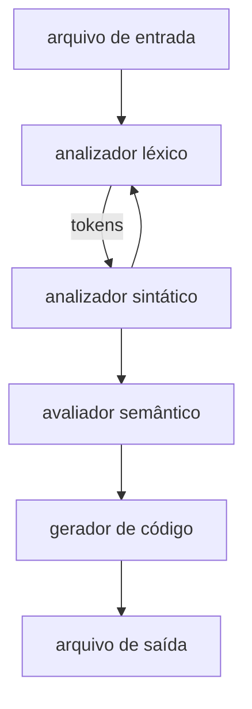

# Pascal

## Programas e Blocos

```pascal
<programa> ::=
  program <identificador> (<lista de identificadores>); <bloco>.

<bloco> ::=
  [<parte de declarações de rótulos>]
  [<parte de definições de tipos>]
  [<parte de declarações de variáveis>]
  [<parte de declarações de sub-rotinas>]
  <comando composto>
```
**Identificador**
```pascal
<identificador> ::=
  <letra> { <letra>|<dígito> }

<lista de identificadores> ::=
  <identificador {, <identificador>}>
```
**Variáveis**
```pascal
<tipo> ::=
  <identificador> | array[<índice> {, <indice>}] of <tipo>

<parte de declarações de variáveis> ::=
  var <declaração de variáveis>
    {; <declaração de variáveis>}

<declaração de variáveis> ::=
  <lista de identificadores> : <tipo>
```

**Comandos**
```pascal
<comando composto> ::=
  begin <comando>{;<comando>} end

<comando> ::=
  [<numero>:] <comando sem rótulo>

<comando sem rótulo> ::=
  <atribuição>
  | <chamada de procedimento>
  | <desvio>
  | <comando composto>
  | <comando condicional>
  | <comando repetitivo>

<atribuição> ::=
  <variável> := <expressão>

<chamada de procedimento> ::=
  <identificador> [(<lista de expressões>)]

<desvio> ::= goto <numero>

<comando condicional> ::=
  if <expressão> then <comando sem rótulo>
                  [else <comando sem rótulo>]

<comando repetitivo> ::=
  while <expressão> do <comando sem rótulo>
```
**Expressões**
```pascal
<lista de expressões> ::=
  <expressão {, <expressão>}>

<expressão> ::=
  <expressão simples>[<relação><expressão simples>]

<relação> ::= = | <> | < | <= | >= | >
```

## Primeiro Programa

Extensão do Pascal: .pas

```pascal
program meuprogramamaneiro(input,output);
begin
  writeln('Hello World!')
  end.
```
Compilação:
```bash
# fpc: free pascal compiler
fpc meuprimeiroprograma.pas
```
# Linguagem Mepa

O compilador é um programa que verifica se uma entrada está de acordo com as regras sintáticas e semânticas de uma gramática e se estiver gera código "executável" (que nesta disciplina é o código MEPA).

Composição de um compilador:

- Modelo Esquemático da MEPA.
- A pilha cresce para cima.
- Da posição $0$ até o topo ($s$), a pilha contém valores válidos. De $s + 1$ para cima, são valores desconhecidos ou inválidos.

As instruções da MEPA implementam o modelo de execução, todas elas são descritas com um mnemônico de quatro letras precedidas ou não de um rótulo.

Nosso objetivo é transformar um programa em Pascal para um programa em MEPA. Construindo todos os passos de um compilador.

As regras sintáticas do bison ajudam nesta geração de código. Um exemplo é quando usar as instruções INPP e PARA.