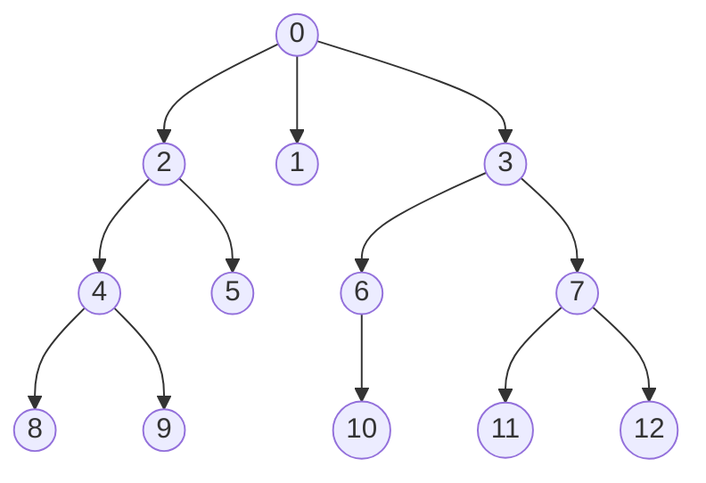
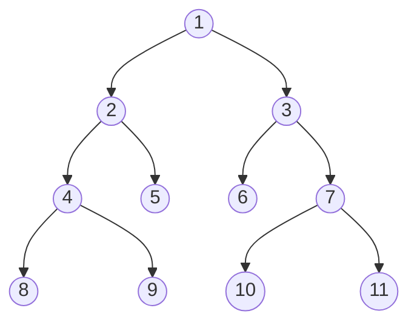

# Árvores

São estruturas compostas por **nós** interligados entre si de tal forma que:

1. Um nó pode ter um único antecessor. Há apenas um nó que não possui antecessor e se chama **raiz**.

2. Um nó pode ter zero ou mais filhos. Um nó que não tem filhos é chamado de **folha**.

**<ins>Ex:</ins>**


## Árvores binárias

São árvores em que cada nó pode ter, no máximo dois filhos.


- Um nível k pode ter, no máximo $2^k$ nós.
- Uma árvore com $n$ nós tem, no mínimo, $\log_2n$ níveis e, no máximo $n$ níveis.

**Representação**
```c
typedef struct no {
  int dado;
  struct no *esq;
  struct no *dir;
} no;

no *raiz;
```