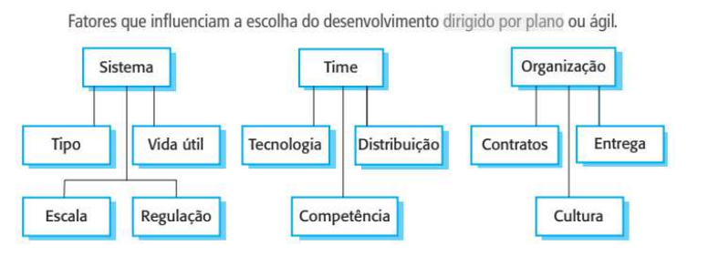

# Escolhas da ESW

## Princípios para decisão

Para escolher uma abordagem adequada, é preciso responder uma série de perguntas envolvendo três naturezas distintas:
- **Técnicas**
- **Humanas**
- **Organizacionais**

## Modelos de Ciclos de Vida

### CASCATA
- O modelo de ciclo de vida em cascata é o modelo de desenvolviento de software mais direto como uma série de processos que devem ser executados apenas uma vez para o projeto.

### INCREMENTAL
- Semelhante ao cascata, porém produz resultados de valor para o cliente mais cedo.
- Levantamento de requisitos e análise de riscos e design geral são feitos em sequência apenas uma vez.
- Várias equipes trabalhando em paralelo em diferentes incrementos.
- Requisitos conhecidos porém instáveis.

### EVOLUTIVO
- Cada processo de levantamento de requisitos e viabilidade do sistema não são realizados apenas uma vez, mas no início de cada ciclo evolutivo.
- Bom para quando os requisitos não são conhecidos, porém um subconjunto é conhecido.

### ESPIRAL
- Principal objetivo está no controle dos riscos do projeto.
- Evita retrabalho e aumenta confiança dos clientes.
- O gerente e desenvolvedores devem está preparados para identificar, mitigar e analisar riscos.

