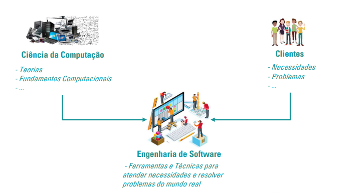
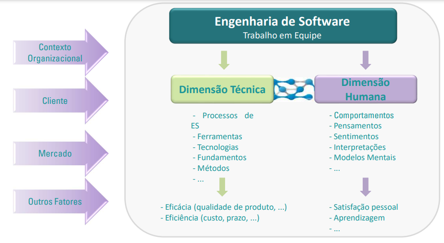

# Fundamentos da ESW

## O que é Engenharia de Software?

- **Software** é mais do que apenas um código de programa. Um programa é um código executável, que serve a algum propósito computacional. O softwre é considerado uma *coleção de código de programação executável*, *bibliotecas* e *documentações* associadas.
- Software, quando criado para um requisito específico, é chamado de **produto de software**.
- A Engenharia, por outro lado, tem tudo a ver com o desenvolvimento de produtos, usando princípios e métodos científicos bem definidos.
- Ou seja, A Engenharia de Software visa **desenvolver produto de software** (coleção de código de programação executável, bibliotecas e documentações), usando **princípios** e **métodos científicos** bem definidos.

## A Natureza Sócio-Técnica da ES

- Grande maioria dos sistemas e produtos de software são desenvolvidos por **EQUIPES**, e não individualmente.
- Indivíduos devem ter capacidade e saber trabalhar em **equipe**
- A equipe deve **equilibrar seus aspectos técnicos e humanos** fundamentais para o **sucesso do desenvolvimento de software**

### TÉCNICO
Métodos, técnicas, processos de produção e tecnologias computacionais.

### HUMANO
Como as pessoas interagem, comportamento, organização, relações de colaboração e confiança.

## Processo de Construção na Engenharia de Software

- Problemas x Solução.
- Algo novo pode ser difícil de resolver.
- Iniciar com a análise do problema.
- Dividir o problema em partes pode facilitar o seu entendimento.

Entender os **problemas do mundo real** e as **necessidades dos usuários**, e propor **soluções**.

- Qualidade do produto.
- Qualidade do processo.
- Qualidade do produto no ambiente de negócios que será utilizado.

## Construção de Software

- **Metodologias**, **processos**, **procedimentos**, **métodos** e **ferramentas**.

- **Metodologia de Engenharia de Software**: uma abordagem filosófica para tratar um problema.

- **Processo de Software**: Uma **estrutura comum** formada por um conjunto de atividades aplicáveis sistematicamente em projetos de software, com o objetivo principal de gerar um produto de software.

- **Procedimento**: maneira de agir, modo de fazer. Pode ser entendimento como um guia, uma maneira estruturada de combinar **ferramentas** e **técnicas** para gerar um resultado.

- **Métodos de Engenharia de Software**: técnica formal para se produzir um resultado.

- **Ferramentas na Engenharia de Software**: computador, quadro Kanbam, To-do List, software de acompanhamento de projeto, cronograma, software de análise de defeitos, etc.
