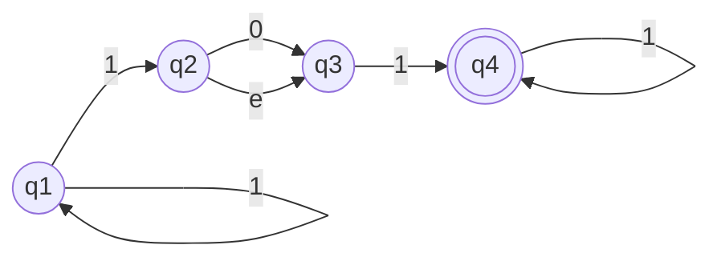
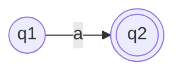
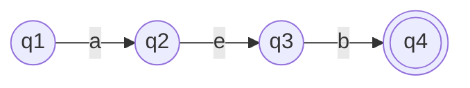
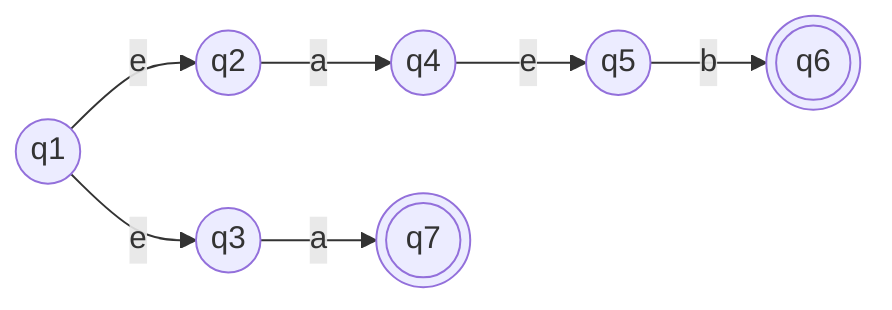
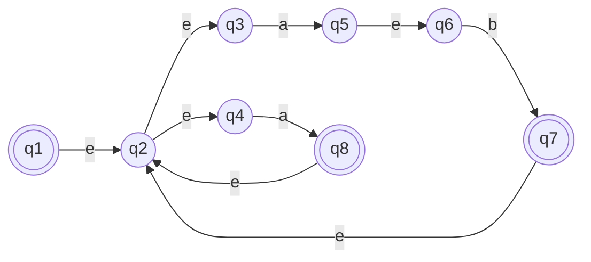

# REGEX -> AFN -> AFNG -> REGEX

**AFN:**

|  | 0 | 1 | $\epsilon$ |
|--|---|---|----------|
|q1|{q1}|{q1,q2}|$\empty$|
|q2|{q3}|$\empty$|{q3}|
|q3|$\empty$|{q4}|$\empty$|
|q4|{q4}|{q4}|  |

## Equivalência REGEX com AF

- Uma linguagem é regular se e seomente se alguma expressão regular a descreve
- Se uma linguagem é descrita por uma expressão regular, então ela é regular

**Conversão de uma expressão regular em uma AFN:**

expressão: *(ab|a)**

**a**

**b**

**ab**

**ab|a**

**(ab|a)***

Se uma linguagem é regular, então ela é descrita por uma expressão regular

## Autômato Finito Não-Determinístico Generalizado

O estado inicial tem setas de transição saindo para todos os outros estados, mas nenhuma seta chegando de qualquer outro estado.

Existe apenas 1 estado de aceitação, e ele tem setas chegando de todos outros estados, mas nenhuma saindo. O estado de aceitação NÃO é o mesmo que o inicial.

Com exceção dos estados inicial e de aceitação, uma seta sai de cada estado para todos os outros e também de cada estado para ele mesmo.

Formalmente um AFNH é uma 5-upla

$(Q,\Sigma,\delta,q_{inicio},q_{aceita})$

Para converter um **AFD** para um **AFNG** adicionando um novo estado inicial e um novo estado de aceitação e setas adicionais conforme necessário. Usamos o procedimento CONVERT($G$) que toma um AFNG como entrada e retorna uma expressão regular equivalente

CONVERT($G$):
1. Seja $k$ o número de estados de $G$
2. Se $k=2$, então $G$ deve consistir de um estado inicial, um estado de aceitação, e uma única seta conectando os dois rotulos com uma expressão regular $R$
- Retorne a expressão R
3. Se $k>2$, selecionemos qualquer $q_{rem} \in Q$ diferente do $q_{inicio}$ e $q_{aceita}$ e seja $G'$ o AFNG $(Q',\Sigma,\delta',q_{inicio},q_{aceita})$, onde:

$ Q' = Q|\{q_{rem}\} $

e para qualquer $q_i \in Q'|\{q_{aceita}\}$ e qualquer $q_j \in Q'|\{q_{inicio}\}$ seja 

$\delta'(q_i,q_j) = ((R_1)(R_2)*(R_3))|(R_4)$

para $R_1 = \delta(q_i,q_{rem})$, $R_2 = \delta(q_{rem},q_{rem})$, $R_3 = \delta(q_{rem},q_j)$ e $R_4 = \delta(q_i,q_j)$.

4. Compute CONVERT($G'$) e retorne este valor