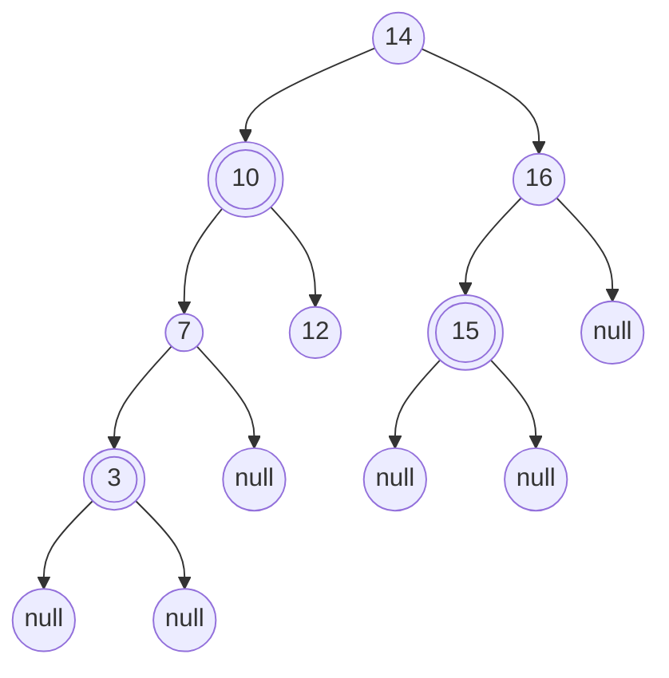
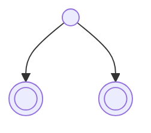
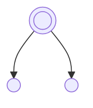
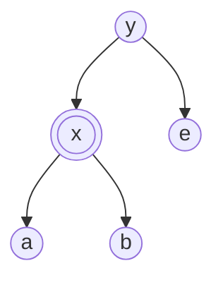
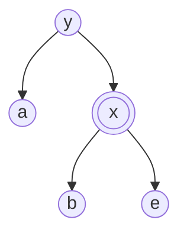

# Árvores rubro-negras esquerdistas

É uma árvore binária de busca (ABB) que satisfaz as seguintes condições:

1. Todo nó é vermelho ou preto.
2. A raiz é preta.
3. As folhas são NULL e pretas.
4. Se um nó é vermelho, então:
    - seus dois filhos são pretos.
    - é filho <ins>esquerdo</ins> de um nó preto.
5. Para qualquer nó, todo caminho que o liga a uma folha tem a mesma quantidade de nós pretos.
    - não contamos o próprio nó.
    - chamamos isso de <ins>altura negra</ins>


*(as bolinhas com dois circulos representam nós vermehlos)*

Seja $bh$ a altura negra da árvore. Portanto, há no mínimo $2^{bh}-1$ nós. Por outro lado, $bh \ge h/2$.

Logo, $n \ge 2^{bh}-1 \ge 2^{h/2}-1$

$\therefore n \ge 2^{h/2}$

$\lg n \ge \lg 2^{h/2} \rightarrow h/2 \le \lg n \rightarrow h \le 2\lg n$

### Representação

```c
typedef enum{VERMELHO, PRETO} cor;

typedef struct no {
  int chave;
  cor cor;
  struct no *esq, *dir;
} no;
```

### Inserção

Todo nó inserido recebe a cor vermelha, pois assim não altera-se a altura negra da árvore.

```c
no *insere(no *r, int x) {
  if (r == NULL) {
    no *novo = (no*)calloc(1, sizeof(no));
    novo->chave = x;
    novo->cor = VERMELHO;
    return novo;
  }
  if (x<r->chave) r->esq = insere(r->esq, x);
  if (x>r->chave) r->dir = insere(r->dir, x);
  /* correção da subárvore com raiz r */
  return r;
}
```

**Casos**

O novo nó é:
1. Filho esquerdo de um nó preto.
2. Filho direito de um nó preto.
    - sobe a cor no pai (irmão vermelho).
    - rotação à esquerda (irmão preto).
3. Filho esquerdo de um nó vermelho.
    - rotação à direita no avô (preto).
    - sobe a cor.
4. Filho direito de um nó vermelho
    - rotação à esquerda no pai.
    - rotação à direita no avô (preto).

**Correções**

1. Subir a cor quando os dois nós de uma subárvore de raiz preta forem vermelhos.



2. Rotação para esquerda



3. Rotação à direita


