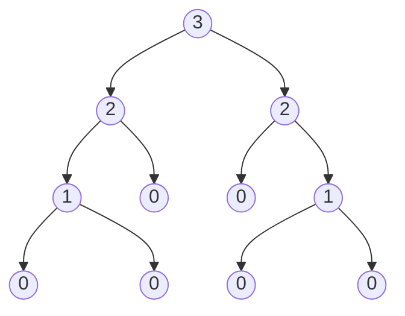
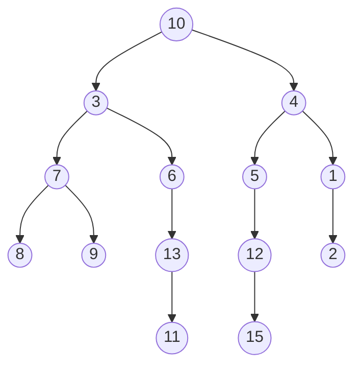

# Árvores

<ins>**Distância**</ins> entre dois nós é a quantidade de <ins>**arestas**</ins> (ligaçoes) que os unem.

A <ins>**altura**</ins> de um nó é a maior distância entre este nó e uma folha da árvore. A <ins>**altura da árvore**</ins> é a altura da raiz.

$Altura\,da\,árvore = Qntd.\,de\,níveis - 1$

### Representação da altura de cada nó


```c
int altura(no *raiz) {
  if (raiz == NULL) return -1;

  int he = altura(raiz->esq);
  int hd = altura(raiz->dir);
  return (he > hd) ? (he+1) : (hd+1);
}
```

### Percursos em Árvores Binárias

1. **Profundidade**

Visam alcançar folhas o quanto antes. Há 3 tipos comuns:

- Pré-Ordem:
  - "visita" raiz
  - esquerda
  - direita

- Em ordem:
  - esquerda
  - "visita" a raiz
  - direita

- Pós-Ordem:
  - esquerda
  - direita
  - "visita" raiz


**Pré-ordem**: 10, 3, 7, 8, 9, 6, 13, 11, 4, 5, 12, 15, 1, 2

**Em-ordem**: 8, 7, 9, 3, 6, 11, 13, 10, 12, 15, 5, 4, 1, 2

**Pós-ordem**: 8, 9, 7, 11, 13, 6, 3, 15, 12, 5, 2, 1, 4, 10

### Balanceamento

Uma árvore é dita balanceada se:
1. Cada nó possui "aproximadamente" a mesma altura.
2. A altura da árvore é "aproximadamente" $\log n$. 