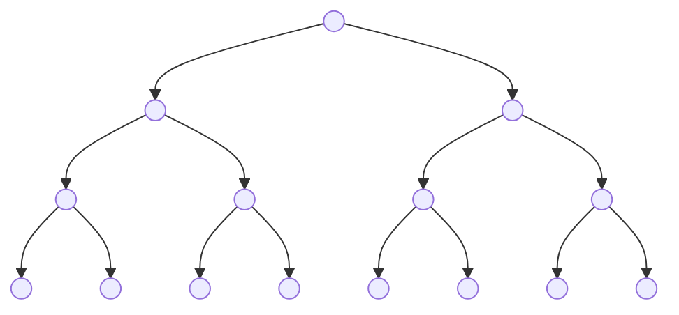
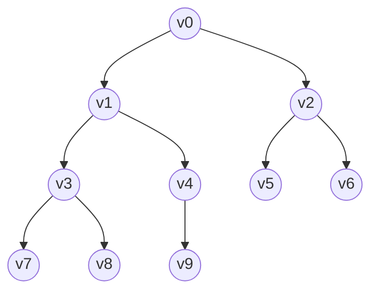

# Filas de prioridade

É uma estrutura em que os elementos são organizados de acordo com uma prioridade de forma a viabilizar a extração do elemento de maior (ou menor) prioridade. Possui, portanto, duas operações:

1. **Inserção**
2. **Extração do elemento de maior prioridade**

A implementação com vetor sempre consumiria $O(n)$ em algumas dessas operações.

## Árvore binárias completas

São árvores em que todos os níveis possuem o máximo de elementos, com exceção, talvez, do último nível.

*exemplo:*

### Representação de uma árvore completa

Nessa implementação, dado um nó $v[i]$,
- **filho esquerdo**: $i*2+1$
- **filho direito**: $i*2+2$ = $esq+1$
- **pai**: $(i-1)/2$

## FP com árvores completas

<ins>**Regra**</ins>: A **raiz** é sempre **maior** que os filhos.

**Atenção: não confunda com ABB.**

Essa estrutura de dados (ou seja, FP implementada com árvore binária completa) é chamada <ins>head de máximo</ins>.

### Inserção
1. Insiro na última posição do vetor.
2. Conserta-se o heap: "sobe" o elemento novo até que seja <ins>menor</ins> que seu pai ou atinja a raiz do heap.

### Remoção (extração do máximo)
1. Troca a raiz com o último elemento do vetor.
2. "Remove" o último elemento do vetor.
3. Conserta o heap: "desce" o elemento na raiz até que seja <ins>maior</ins> que seus filhos ou se torne uma folha.

## Implementação

```c
typedef struct {
  int *ch;
  int tam, n;
} FP;

FP *cria_fp(int tam) {
  FP *fp = malloc(sizeof(FP));
  fp->ch = malloc(tam*sizeof(int));
  fp->tam = tam;
  fp->n = 0;
  return fp;
}
```
### Inserção
```c
// O(log n)
void sobe_no_heap(FP *fp) {
  int k = fp->n-1;
  int pai = (k-1)/2;
  while(k > 0 && fp->ch[k] > fp->ch[pai]) {
    troca(&fp->ch[k], &fp->ch[pai]);
    k = pai;
    pai = (k-1)/2;
  }
}

// O(log n)
void inserir(FP *fp, int x) {
  if(fp->n >= fp->tam) {
    fp->ch = realloc(fp->ch, 2 * fp->tam * sizeof(int));
    fp->tam *= 2;
  }
  fp->ch[fp->n++] = x;
  sobe_no_heap(fp);
}
```

### Remoção
```c
int maior(FP *fp, int k, int *m) {
  int valor = fp->ch[k];
  int esq = 2*k+1, dir = esq+1;
  if (esq < fp->n && fp->ch[esq] > valor) {
    valor = fp->ch[esq];
    *m = esq;
  }
  if (dir < fp->n && fp->ch[dir] > valor) {
    valor = fp->ch[dir];
    *m = dir;
  }
  return valor;
}

void desce_no_heap(FP *fp) {
  int k=0, m;
  while (maior(fp, k, &m) > fp->ch[k]) {
    troca(&fp->ch[m], &fp->ch[k]);
    k = m;
  }
}

int extrair(FP *fp) { // remoção.
  troca(&fp->ch[0], &fp->ch[fp->n-1]);
  fp->n--;
  desce_no_heap(fp);
  return fp->ch[fp->n];
}
```