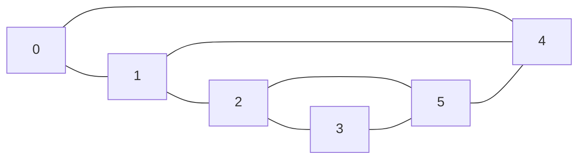

# Grafos

Um grafo é um conjunto de objetos interligados entre si. Os objetos são chamados de vértices e as ligações, de arestas.

Matematicamente, é um par ordenado $(V, A)$ em que $V$ é o conjunto de vértices e A, de arestas.

**ex:**

$V = \{0,1,2,3,4,5\}$

$A = \{\{0,1\},\{0,4\},\{1,2\},\{1,4\},\{2,3\},\{2,5\},\{3,5\},\{4,5\}\}$

## Representação de grafos

### 1. Matriz de adjacências

**ex:**

|   | 0 | 1 | 2 | 3 | 4 | 5 |
|---|---|---|---|---|---|---|
| 0 |   | 1 |   |   | 1 |   |
| 1 | 1 |   | 1 |   | 1 |   |
| 2 |   | 1 |   | 1 |   | 1 |
| 3 |   |   | 1 |   |   | 1 |
| 4 | 1 | 1 |   |   |   | 1 |
| 5 |   |   | 1 | 1 | 1 |   |

### 2. Lista de adjacência

| 0 | 1 | 2 | 3 | 4 | 5 |
|---|---|---|---|---|---|
| 1 | 0 | 1 | 2 | 0 | 2 |
| 4 | 2 | 3 | 5 | 1 | 3 |
|  | 4 |  |  | 5 | 4 |