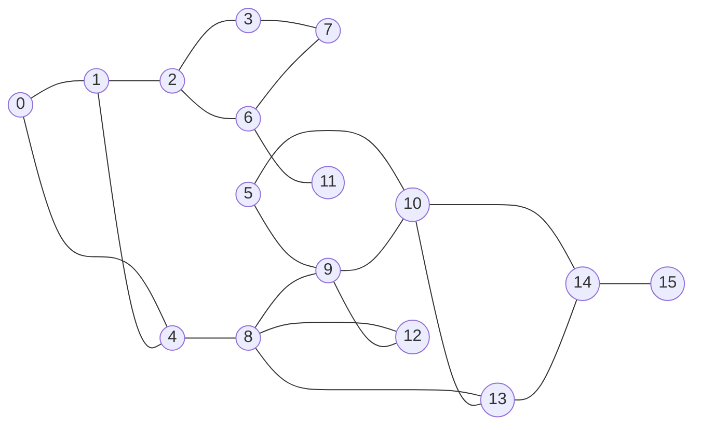
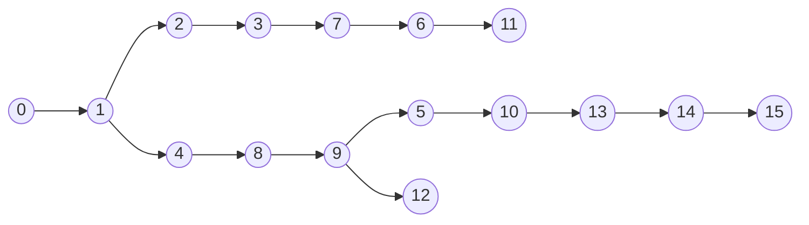
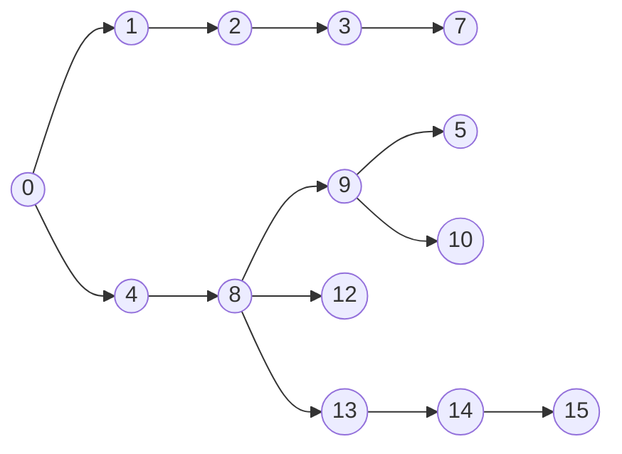
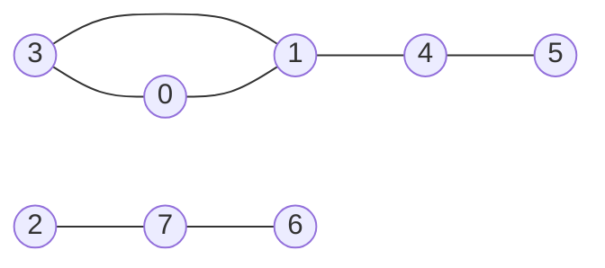
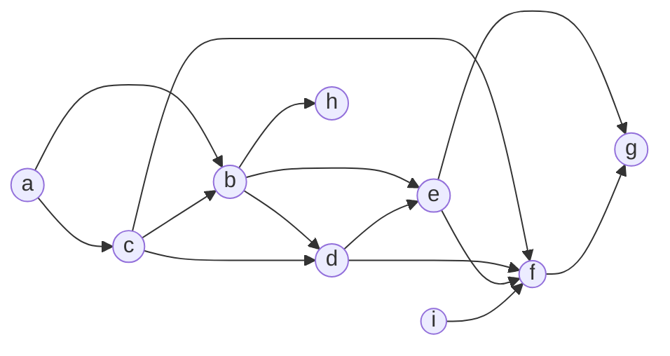

# Percursos em grafos

Um caminho entre dois vértices $u$ e $v$ é uma sequência de vértices adjacentes, sem **repetição**, começando em $u$ e terminando em $v$.


## 1. Busca em profundidade - DFS (depth-first-search)


Árvore de profundidade
- mais "alongada"

Vetor Pai:
| 0  | 1  | 2  | 3  | 4  | 5  | 6  | 7  | 8  | 9  | 10 | 11 | 12 | 13 | 14 | 15 |
|----|----|----|----|----|----|----|----|----|----|----|----|----|----|----|----|
| 0 | 0  | 1 | 2 | 1 | 9 | 7 | 3 | 4 | 8 | 5 | 6 | 9 | 10 | 13 | 14 |

```c
int caminhos(grafo *g, int s) {
  int *pai = malloc(g->n*sizeof(int));
  for (int i=0; i<g->n; i++) pai[i] = -1;
  dfs(g, pai, s, s);
  return pai;
}
```
```c
void dfs(grafo *g, int *pai, int p, int v) {
  pai[v]=p;
  for (int i=0; i<g->n; i++) {
    if (g->adj[v][i] && pai[i] == -1)
      dfs(g, pai, v, i);
  }
}
```

## 2. Busca em largura (breadth first-search)


Árvore de largura
- menor caminho (em saltos)

Vetor Pai:
| 0  | 1  | 2  | 3  | 4  | 5  | 6  | 7  | 8  | 9  | 10 | 11 | 12 | 13 | 14 | 15 |
|----|----|----|----|----|----|----|----|----|----|----|----|----|----|----|----|
| 0 | 0  | 1 | 2 | 0 | 9 | 2 | 3 | 4 | 8 | 9 | 6 | 8 | 8 | 13 | 14 |

```c
int *bfs(grafo *g, int u) {
  int *pai = malloc(g->n*sizeof(int));
  for (int i=0; i<g->n; i++) pai[i] = -1;
  pai[u] = u;
  enfileira(u);
  while (!fila_vazia(u)) {
    u = desenfileira();
    for (int v=0; v<g->n; v++) {
      if (g->adj[u][v] && pai[v] == -1) {
        pai[v] = u; enfileira(v);
      }
    }
  }
  return pai;
}
```
## Aplicações de DFS

### 1. Componentes conexas

**Componentes conexas** são subgrafos $G'=(V',F')$ de $G$ tal que existe caminho entre quais vértices $u$ e $v$ de $V'$.

Quantas e quais são as componentes conexas de um grafo?

```c
int *comp_conexas(grafo *g) {
  int *comp = calloc(g->n, sizeof(int)), c = 1;
  for (int v=0; v<g->n; v++)
    if(!comp[v]) {
      dfs(g, comp, c, v);
      c++;
    }
  return comp;
}
```
```c
void dfs(grafo *g, int *comp, int c, int v) {
  comp[v] = c;
  for (int w=0; w<g->n; w++)
    if (g->adj[v][w] && !comp[w])
      dfs(g, comp, c, w);
}
```

### 2. Ordenação topológica


```c
void ord_topologica(grafo *g, int a) {
  int *vis = calloc(g->n, sizeof(int));
  dfs(g, vis, a);
}
```
```c
void dfs(grafo *g, int *vis, int v) {
  vis[v] = 1;
  for (no *w=g->adj[v]; w != NULL; w=w->prox)
    if (!vis[w->ind])
      dfs(g, vis, w->ind);
  print("%d", v);
}
```
