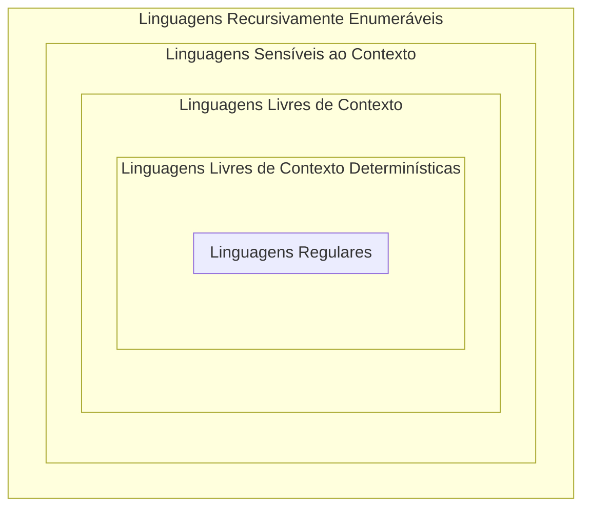
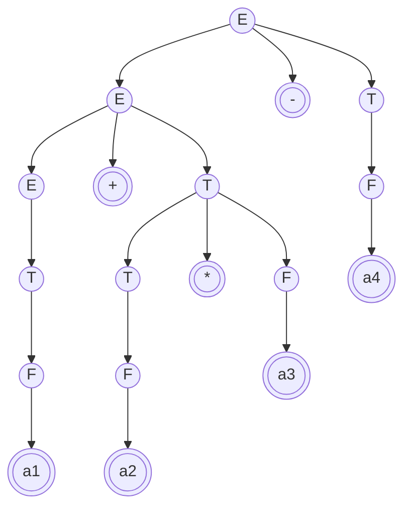

19# Analisadores sintáticos

## Análise Sintática

A análise sintática (parsing) é um processo que verifica se uma determinada entrada (setença) corresponde ao de uma gramática.

- Seja $G1$ uma gramática;
- Seja $L(G1)$ a linguagem definida por $G1$;
- Seja $\alpha$ uma sentença de entrada.
- Então, formalmente, um analisador sintático é uma ferramenta capaz de dizer se:

$\alpha \in L(G1)$

## Gramáticas

Uma gramática é a formalização de uma determinada linguagem.

### Hierarquia de Chomsky

É uma classificação de gramáticas formais descrita em 1959 pelo linguista Noam Chomsky.

Cada linguagem da hierarquia tem um tipo de autômato que é capaz de reconhecê-la.

*Exemplos:*
- Autômato Finito reconhece Ling. Regulares.
- Autômato com Pilha reconhece LLC.

A hierarquia de Chomsky não apresenta uma classe importante de linguagens: As linguagens livres de contexto deterministicas (um subconjunto das LLC onde as linguagens não são ambíguas).

**Todas linguagens de programação pertencem a esta classe**

### Ambiguidade

$G2$ abaixo é uma gramática ambígua pois permite duas árvores de derivação para uma mesma sentença $(\alpha = "aaa")$

- $G2 = \{A \rightarrow Aa|aA|a\}$

$G3$ não é ambígua

- $G3 = \{A \rightarrow Aa|a\}$

$L(G2) = L(G3)$.
Esta linguagem não é ambígua, mas uma gramática mal escrita pode levar a pensar assim

## Analisadores Sintáticos

Métodos para se construir a árvore sintática de um $\alpha$:
1. "cima para baixo" (top-down)
2. "baixo para cima" (bottom-up)

Existem ferramentas que recebem como entrada uma gramática e geram como saída o A.S. desta gramática.

- top-down: javacc;
- bottom-up: bison;

Estas ferramentas incluem mecanismo de executar o código do usuário em pontos determinados da árvore sintática. A isto se dá o nome de "Tradução Dirigida pela Sintaxe" (TDS).

Considere o problema de transformar uma entrada que está na notação posfixa. Exemplo:

$"a_1 + a_2 * a_3 - a_4" \rightarrow "A_1A_2A_3 *+ A_4 -"$

A entrada obedece a uma gramática (G4 abaixo).

$G4 = \{\\
\quad E ::= E+T | E-T | T\\
\quad T ::= T*F | F\\
\quad F ::= a\\
\}$

A ideia é acrescentar nós "executáveis" à árvore. Estes nós são trechos de programa, no nosso caso, C.

Toda vez que um trecho destes for encontrado, deve-se pendurá-lo na árvore.

Ao concluir a construção da árvore, faça o caminhamento inorder, executando os nós "executáveis"

Construa a árvore abaixo para a mesma entrada e caminhe pos ordem. Ao encontrar um nó executável, execute-o e veja o resultado gerado na saída

$G4 = \{\\
\quad E ::= E+T $ {printf("+")} $ | E-T $ {printf("+")} $ | T\\
\quad T ::= T*F $ {printf("*")} $ | F\\
\quad F ::= a $ {printf("A")} $ \\
\}$

