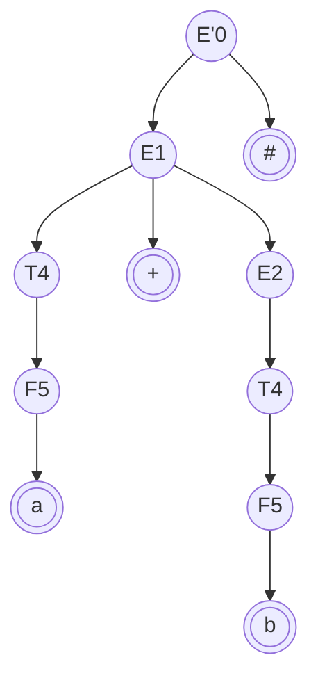

# Analisadores Sintáticos Top-Down

Esta categoria de analisadores sintáticos tem as seguintes características:

- lêem a entrada da esquerda para a direita *(left to right parsing)*;
- constroem a árvore de derivação de cima para baixo substituindo sempre o terminal mais à esquerda *(leftmost derivation)*

## Ferramentas

Para escrever um programa capaz de fazer a análise sintática Top-Down, existem várias abordagens:

- Tentar todas as possibilidades (algoritmo da força bruta). Complexidade combinatorial
- Adaptar a gramática para utilizar um Analisador Sintático preditivo que tem complexidade linear;
- Utilizar compilador de compiladores disponíveis nas linguagens de programação, como por exemplo (Javacc).

### Analisador Sintático com Retrocessos

Também conhecido como Analisador Sintático com Retrocessos (backtracking), tenta construir todas as árvores possíveis onde os símbolos de entrada consigam ser pendurados

- Algoritmo recursivo: Coloque $S$ como raiz da árvore de derivação;
- Seja $X$ a variável mais à esquerda;
- Selecione uma produção do tipo $X \rightarrow ABC$
- Se houverem alguma, pendure;
- Se não houver, descarte a última produção;
- Reaplique o algoritmo

$\alpha = a+b\#$

$G_1 = \{\\
\quad E' \rightarrow E\#\\
\quad E \rightarrow E+T\\
\quad E \rightarrow T\\
\quad T \rightarrow F*T\\
\quad T \rightarrow F\\
\quad F \rightarrow a\\
\quad F \rightarrow b\\
\quad F \rightarrow (E)\\$

Árvore de derivação:

A gramática tem que ser modificada para um determinado formato determinado LL(1)
- Left to right parsing;
- Leftmost derivation;
- Examinam um único token à frente;

Seja $G_1 \notin LL(1)$ uma gramática. Aplicar as modificações abaixo para obter $G_2 \in LL(1)$;
- Eliminar retrocessos;
- Fatoração;
- Eliminar Recursão Esquerda