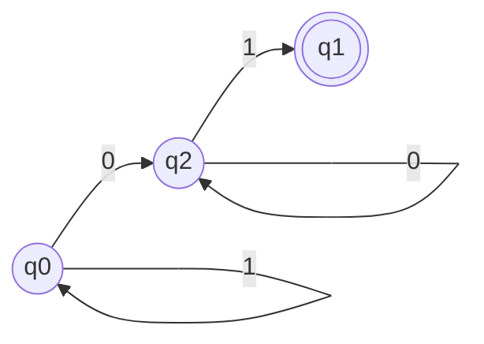
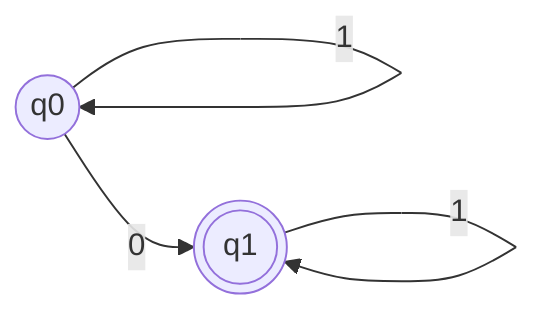
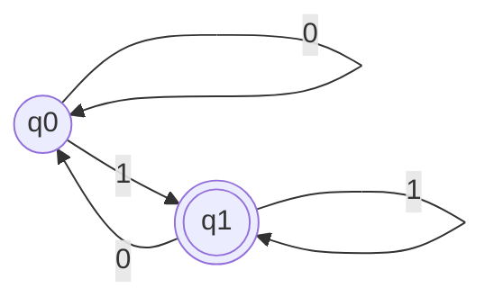
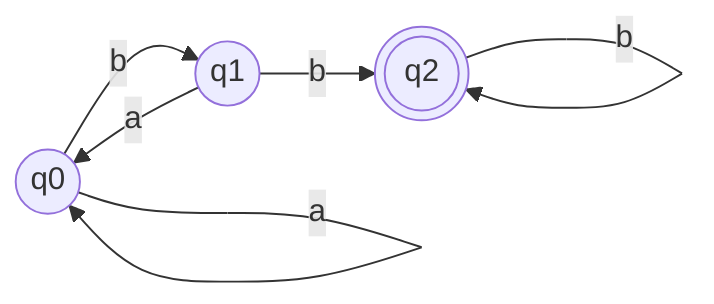
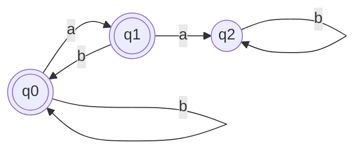
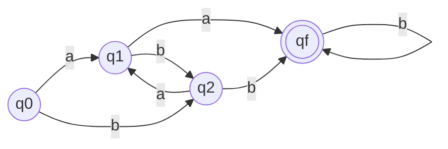

# Autômatos Finitos Determinísticos

## Autômatos Finitos

O que é?
- Modelo matemático:
  - Modela uma máquina simples;
  - Utilizadas para reconhecer uma linguagem;
  - Possui entradas e saídas finitas
    - **Entrada:** determinada sequência de simbolos do alfabeto
    - **Saída:** estados que devem ser predefinidos.
  - Por que predefinido?
    - Não possui memória auxiliar
    - Informação "memorizada" por cada estado
- Exemplos
  - Caixa eletrônico, Máquina de Refrigerante, Televisão.

Tipos:
- Determinístico:
  
  estado corrente $+$ símbolo de entrada $\rightarrow$ estado resultante **único**
- Não Determinístico:
  
  estado corrente $+$ símbolo de entrada $\rightarrow$ estado resultante pertencente a um **conjunto** de estados alternativos.
  
  estado corrente $+$ nenhum símbolo de entrada $\rightarrow$ estado resultante pertencente a um **conjunto** de estados alternativos.

Formado por três partes:
- **Entrada**
- **Controle**
- **Função de transição**

Definição formal:

$M = (Q,\Sigma,\delta,q_0,F)$

- $Q$ é o conjunto finito não vazio de estados;
- $\Sigma$ é o alfabeto de símbolos de entrada;
- $\delta : \Sigma \times Q \rightarrow Q$ é a função de transição;
- $q_0 \in Q$ é o estado inicial.
- $F \subseteq Q$ é o subconjunto de estados finais.

## Autômatos Finitos Determinísticos

Um autômato finito SEMPRE termina, não existe LOOP infinito. Computação de um autômato finito:

- Palavra de entrada $w$
- Sucessivas aplicações da função de transição para cada símbolo $w$ (da esquerda para direita)
- Até ocorrer uma condição de parada

Condição de parada:

- **aceita**
- **rejeita**

## Exercícios

### Exercício 1

Dados as expressões regulares:

- $0(0+1)*$
- $(0+1)*1$

Respostas:
- Quais as linguagens que as expressões regulares definem?
- Construa a AFD correspondente

Resolução:

As linguagens das duas expressões regulares são os símbolo (0, 1).

### Exercício 2

Dadas as linguagens:
- $L$ = { $ w \in \{0,1\}*|w $ contém pelo menos um 0 }
- $L$ = { $ w \in \{a,b\}*|w $ possui dois b's consecutivos }
- $L$ = { $ w \in \{a,b\}*|w $ não possui dos a's consecutivos }

Construa o AFD que reconhece cada uma das linguagens acima.

Resolução:

### Exercício 3

Dado o AFD e sua respectiva linguagem:

$L =$ { $w|w$ possui $aa$ ou $bb$ como subpalavra }

Responda:

Mostre a função estendida das palavras:

- aabaabb
- babab
- bbab
- aabb

Construa a tabela de transição do AFD

$\delta^*(q_0, aabaabb)$

$\delta^*(\delta(q_0, a), baabb)$

$\delta^*(\delta(q_1, b), aabb)$

$\delta^*(\delta(q_2, a), abb)$

$\delta^*(\delta(q_1, a), bb)$

$\delta^*(\delta(q_f, b), b)$

$\delta^*(\delta(q_f, b), \epsilon)$

Tabela de transição:

|  | a | b |
|--|---|---|
|q0|q1 |q2 |
|q1|qf |q2 |
|q2|q1 |qf |
|qf|qf |qf |