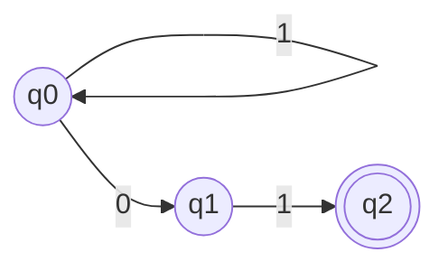
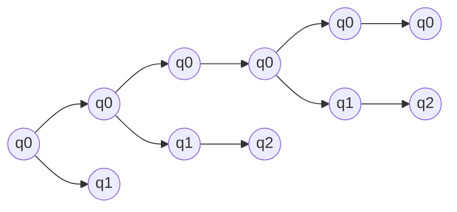

# Autômatos Finitos Não-Determinísticos

## Definição

O autômato finito não-determinístico pode estar em vários estados ao mesmo tempo
- capacidade de *adivinhar* algo sobre sua entrada.

O AFN aceita as mesmas linguagens de um AFD
- são mais sucintos e mais fáceis de projetar.

Um autômato finito não-determinístico consiste em:
- Um conjunto finito de estados: $Q$
- Um conjunto finito de símbolos de  entrada: $\Sigma$
- Uma função de transição que torna como argumentos um estado e um símbolo de entrada, e retorna o subconjunto de $Q: \delta$
- Um estado inicial (que está em $Q$)
- Um conjunto de estados finais $F$ ($F$ é um subconjunto de $Q$)

$A = (Q, \Sigma, \delta, q_0, F)$

### Exemplo

$L$ = { $ w|w $ aceita todas as strings que terminam em 01 }

Como seria o AFN que aceita essa linguagem?

Entrada: $0 0 1 0 1$

Tabela de transição:

|  | 0 | 1 |
|--|---|---|
|q0|{q0,q1}|q1|
|q1| - |q2 |
|q2| - | - |

Como o conjunto de estados é $\{q_0, q_1, q_2\}$, a construção de subconjuntos produz um AFD com $2³$ = 8 estados