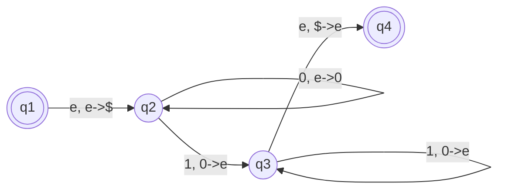

# Gramática Livre-do-contexto

- Um método poderoso de descrever linguagens
- Estudamos AF e REGEX, descrevem muitas linguagens, mas algumas linguagens simples não podem ser representadas
- As gramáticas livres-do-contexto podem descrever certas características que têm uma estrutura recursiva!
- Foram primeiro utilizadas no estudo de linguagens humanas, uma maneira de entender o relacionamento de termos tais como: nome, verbo e preposição e suas respectivas frases levam a uma recursão natural, porque frases nominais podem aparecer dentro de frases verbais e vice-versa.

**Aplicação**

Especificação e compilação de linguagens de programação.

- Uma gramática de linguagem de programação frequentemente aparece como uma referência para pessoas tentando aprender a sintaxe da linguagem.

## Autômatos com Pilha

São como autômatos finitos não-determinísticos, mas tem um componente extra chamado **PILHA**.

A pilha provem memória adicional além da quantidade finita disponível no controle. A pilha permite que o autômato com pilha reconheça algumas linguagens não regulares.

Um AP pode escrever simbolos na pilha e lê-los de volta mais tarde.

- Em qualquer momento, o símbolo no topo da pilha pode ser lido e removido
- Escrever na pilha: **empilhar(push)**
- Remover símbolo na pilha: **desempilhando(pop)**
- Somente o topo pode ser lido e modificado.

### Definição Formal

Um automato com pilha é uma 6-upla $(Q, \Sigma, \Gamma, \delta, q_0, F)$, onde $Q$, $\Sigma$, $\Gamma$ e $F$ são todos conjuntos finitos, e

1. $Q$ é **conjunto dos estados**
2. $\Sigma$ é **alfabeto**
3. $\Gamma$ é **alfabeto da pilha**
4. $\delta : Q \times \Sigma_\epsilon \times \Gamma_\epsilon \rightarrow P(Q, \Gamma_\epsilon)$ é função de transição
5. $q_0 \in Q$ é **o estado inicial**
6. $F \subseteq Q$ é **conjunto de estados físicos**

Um AP $M=(Q, \Sigma, \Gamma, \delta, q_0, F)$ computa da seguinte maneira. Ele aceita a entrada $w$ se $w$ puder ser escrita como

$w=w_1w_2 ... w_m$

onde cada $w_i \in \Sigma_\epsilon$ e existem uma sequência de estados $r_0, r_1, ..., r_m \in Q$ e cadeias $s_0,s_!,...,s_m \in \Gamma$ que satisfazem as três condições a seguir. 

1. $r_0 = q_0$ e $s_o = \epsilon$
- $M$ inicia no estado inicial e com a pilha vazia
2. Para $i=0,...,m-1$, temos $(r_{i+1}, b) \in \delta(r_i, w+1, a)$, onde $s_i = at$ e $s_{i+1} = bt$ para algum $a, b \in \Gamma\epsilon$ e $t \in \Gamma$
- Esta condição afirma que $M$ se move conforme o estado, a pilha e o próximo símbolo de entrada.
3. $r_m \in F$

*exemplo:*

$L = \{ 0^n 1^n | n \ge 0 \}\,\,$
$M_1 = (Q,\Sigma,\Gamma,\delta,q_1,F)$

$Q = \{q_1,q_2,q_3,q_4\}$

$\Sigma = \{0,1\}$

$\Gamma = \{0,\$\}$

$F = \{q_1,q_4\}$

$\delta$:

| | | 0 | | | 1 | | | $\epsilon$ | |
|-|-|-|-|-|-|-|-|-|-|
|  | 0 | $ | $\epsilon$ | 0 | $ | $\epsilon$ | 0 | $ | $\epsilon$ |
| $q_1$ |  |  |  |  |  |  |  |  | $\{(q_2,\$)\}$ |
| $q_2$ |  |  | $\{(q_2,0)\}$ | $\{(q_3,\epsilon)\}$ |  |  |  |  |  |
| $q_3$ |  |  |  | $\{(q_3,\epsilon)\}$ |  |  | $\{(q_4,\epsilon)\}$ |  |  |
| $q_4$ |  |  |  |  |  |  |  |  |  |

$(q_1,0011, \epsilon) \rightarrow (q_2,0011, \$) \rightarrow (q_2,011, 0\$) \rightarrow (q_2,11, 00\$) \rightarrow (q_3,1, 0\$) \rightarrow (q_3,\epsilon, \$) \rightarrow (q_4,\epsilon, \epsilon)$