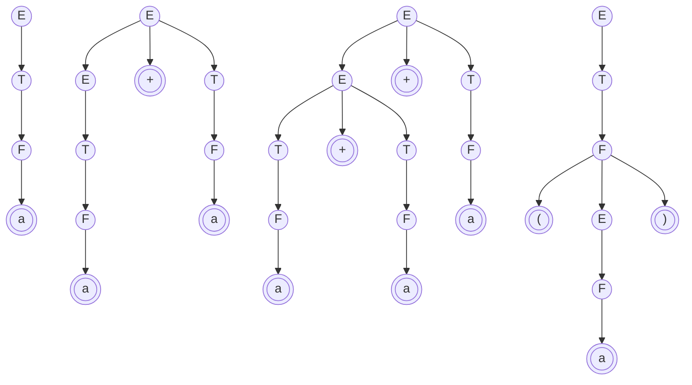

# Lista pré-Prova 2

Link da lista: 
https://brunoribas.com.br/compiladores/2019-1/lista-offline/t.html

1. GLC é a sigla para Gramática Livre de Contexto, é uma maneira poderosa de descrever linguagens formal, formada por um conjunto de regras de produção que envolve terminais e não-terminais, as GLC geram cadeias aplicando regras de produção repetidamente, essas cadeias podem ser representadas por árvores de derivação.

2. G = $\{V, \Sigma, R, S\}$, onde
- V = As variáveis ou não-terminais
- $\Sigma$ = Os terminais da gramática
- R = As regras de produção da gramática
- S = O símbolo inicial

3. 

4. 
- R, S, T, X
- a, b, $\epsilon$
- R
- Verdadeiro
- Falso
- baa, ab, aaba
- a, b, aa

5. 
- V = {< STMT >, < ASSIGN >, < IF-THEN >, < IF-THEN-ELSE >}
- $\Sigma$ = {if, condition, then, a, :=, 1}

A regra do if-then-else pode causar ambiguidade pois a regra else pode ser associada ao if mais interno ou ao if mais externo.