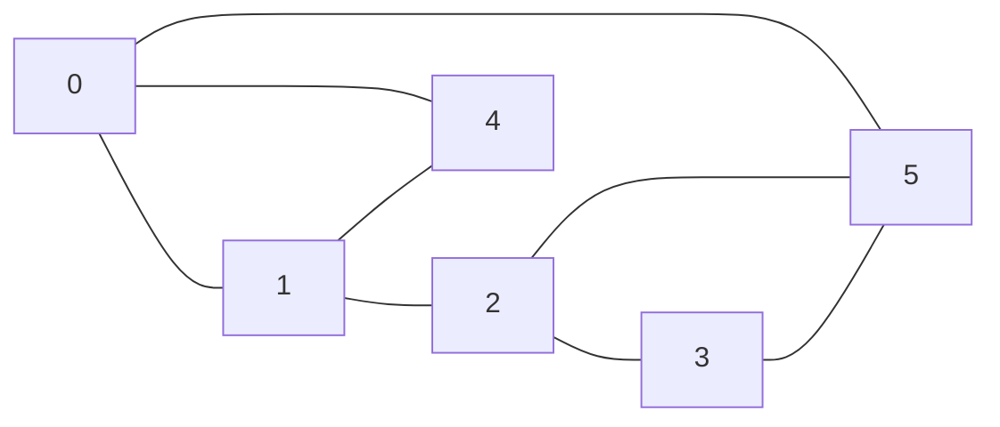

# Grafos

## Exemplos

### 1. O vértice "mais popular"


Com matriz de adjacência:

```c
int mais_popular(grafo *g) {
  int grau_max = 0, r_max, grau;
  for (int i=0; i<g->n; i++) {
    grau = 0;
    for (int j=0; j<g->n; j++)
      grau += g->adj[i][j];
    if (grau >= grau_max) {
      grau_max = grau;
      v_max = i;
    }
  }
  return v_max;
}
```
Com lista de adjacência:
```c
int mais_popular(grafo *g) {
  int grau_max = 0, r_max, grau;
  for (int i=0; i<g->n; i++) {
    grau = 0;
    no *v = g->adj[i]->prox;
    while (v != NULL) {
      grau++;
      v = v->prox;
    }
    if (grau >= grau_max) {
      grau_max = grau;
      v_max = i;
    }
  }
  return v_max;
}
```

### 2. Indicação de conexão


```c
void imprime_recomendacoes(grafo *g, int u) {
  // usa um vetor auxiliar para marcar as recomendações.
  int *rec = calloc(g->n, sizeof(int));
  // passa por cada vizinho de u.
  for (int v=0; v<g->n; v++)
    if (g->adj[v][u])
      // passa por cada vizinho de v.
      for (int w=0; w<g->n;w++)
        if (g->adj[w][v] && !g->adj[w][u]) rec[w] = 1;

  for (int w=0; w<n; w++)
    if (rec[w]) printf("%d ", w);
}
```
$O(n)$ ou $O(\delta_{max})$ usando listas.

## Caminhos

Um caminho entre dois vértices $u$ e $v$ é uma sequência de vértices adjacentes, sem **repetição**, começando em $u$ e terminando em $v$.