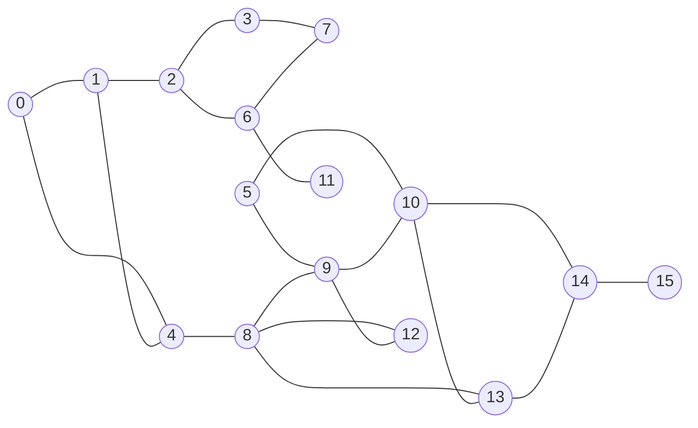
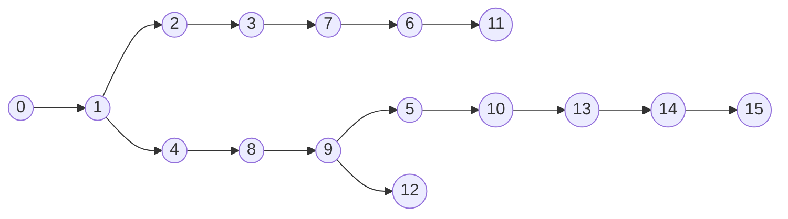
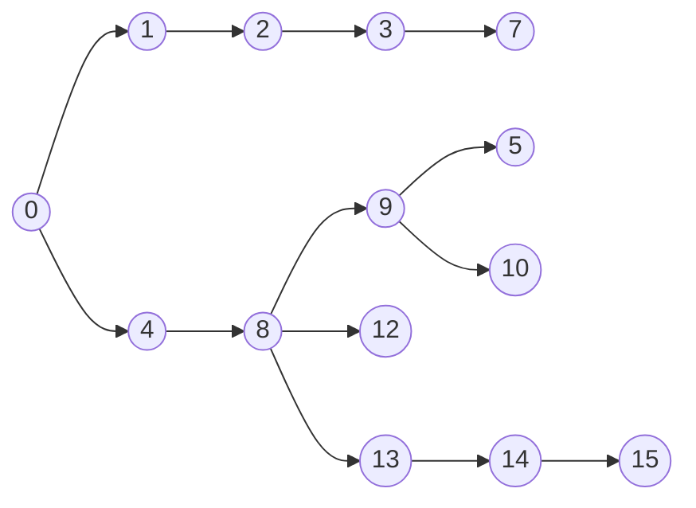

# Percursos em grafos

Um caminho entre dois vértices $u$ e $v$ é uma sequência de vértices adjacentes, sem **repetição**, começando em $u$ e terminando em $v$.


## 1. Busca em profundidade - DFS (depth-first-search)


Árvore de profundidade
- mais "alongada"

Vetor Pai:
| 0  | 1  | 2  | 3  | 4  | 5  | 6  | 7  | 8  | 9  | 10 | 11 | 12 | 13 | 14 | 15 |
|----|----|----|----|----|----|----|----|----|----|----|----|----|----|----|----|
| 0 | 0  | 1 | 2 | 1 | 9 | 7 | 3 | 4 | 8 | 5 | 6 | 9 | 10 | 13 | 14 |

```c
int caminhos(grafo *g, int s) {
  int *pai = malloc(g->n*sizeof(int));
  for (int i=0; i<g->n; i++) pai[i] = -1;
  dfs(g, pai, s, s);
  return pai;
}
```
```c
void dfs(grafo *g, int *pai, int p, int v) {
  pai[v]=p;
  for (int i=0; i<g->n; i++) {
    if (g->adj[v][i] && pai[i] == -1)
      dfs(g, pai, v, i);
  }
}
```

## 2. Busca em largura (breadth first-search)


Árvore de largura
- menor caminho (em saltos)'