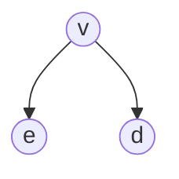
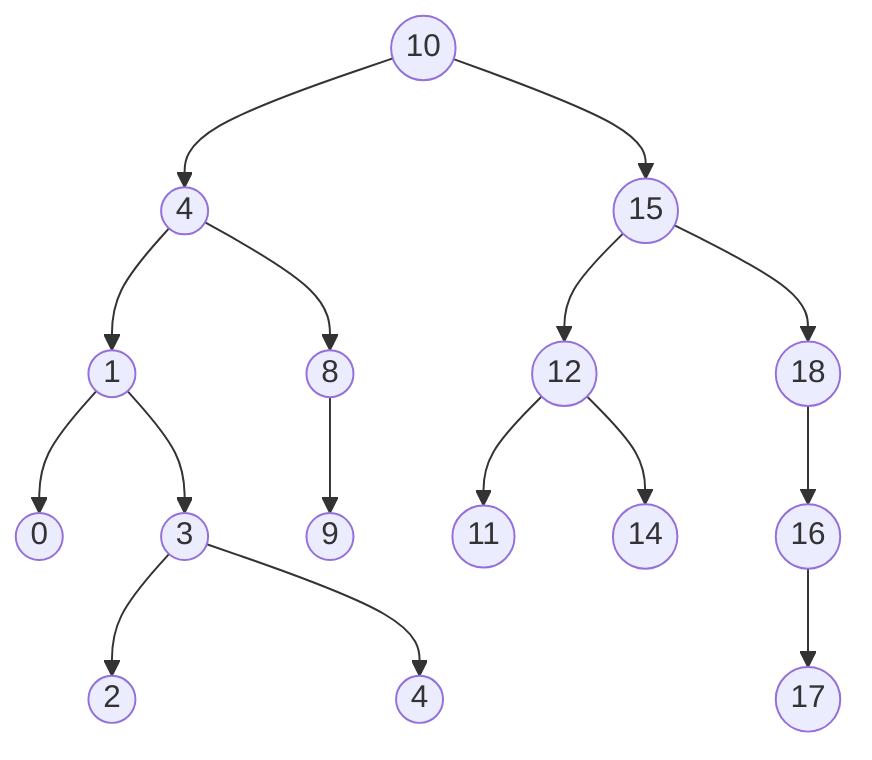

# Árvores

## Árvore binária de busca

É uma árvore binária tal que, para cada nó $v$ da árvore, vale que:

$e.chave \le v.chave \le d.chave$,

para qualquer nó $e$ (respectivo d) pertencente à subárvore esquerda de $v$ (respectiva direita de v).



**<ins>Ex:</ins>**


1. **Busca:**
```c
no *busca(no *r, int x) {
  if (r == NULL || r->chave==x)
    return r;

  if (x<r->chave) busca(r->esq, x);
  else busca(r->dir, x);
}
```
$O(\log n)$, se a <ins>árvore for balanceada</ins>. $O(n)$ caso contrário.

2. **Inserção**
```c
no *insere(no *r, int y) {
  if (r == NULL) {
    no *novo = malloc(sizeof(no));
    novo->chave = y;
    novo->esq = novo->dir = NULL;
    return novo;
  }

  if (y < r->chave) r->esq = insere(r->esq, y);
  if (y > r->cahve) r->dir = insere(r->dir, y);
  /* faça o que for necessário com a igualidade aqui */

  return r;
}
```

3. **Remoção**

Antecessor: maior da sub. esq.
Sucessor: menor da sub. dir.

1. Encontrar o nó $V$.
2. Encontre o maior da sub. esquerda **ou** menor da sub. direita ($z$)
3. Troca $v$ com $z$.
    - isso conserva as propriedades do ABB.
4. Remova $v$.

(1.) e (2.) = $O(\log n)$ para árvore balanceada e $O(n)$ para desbalanceada.

```c
no *remove(no *r) {
  if (r->esq != NULL) {
    no *p = r, *q = r->esq;

    while(q->dir != NULL) {
      p=q;
      q=q->dir;
    }

    r->chave = q->chave; // troca r com q.

    if (p==r) p->esq = q->esq;
    else p->dir=q->esq;

    free(q);
    return r;
  } else {
    no *q = r->dir;
    free(r);
    return q
  }
}

/*
  chamada da função:
  v->esq = remove(v->esq);
*/
```