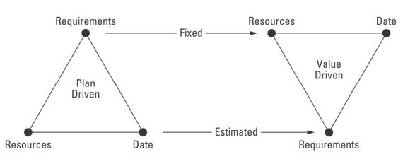
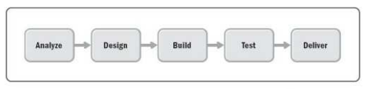
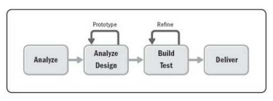
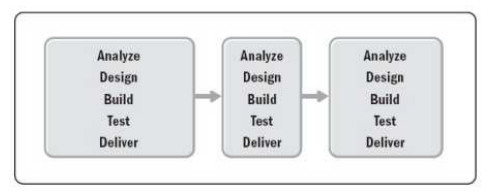

# Abordagens, Ciclos de Vida e Processo

## Abordagens de Desenvolvimento

### Dirigidas por Plano
- Maior esforço durante o começo do projeto.
- Levantamento de todos os requisitos antes do desenvolvimento.
- A mudança de requisitos requer a retestagem e reimplementação.
- Sobrecarga no planejamento, desenvolvimento e documentação do sistema.
- Mais adequada para sistemas que precisam de uma análise completa, como sistemas de controle críticos.

### Ágeis
- Recomedando para sistemas que envolvem negócios, ou que sofrem constantes mudanças e estão em um ambiente instável.
- Especificação, projeto e implementação intercalados.
- Documentação minimizada ou gerada automaticamente.
- Documento de requisitos (características mais importantes do sistema).
- Incrementos
- Usuários e stakeholders envolvidos na especificação

## Ciclos de Vida

O ciclo de vida de um software passa desde a definição dos seus **requisitos**, codificação, manutenção, até sua **descontinuidade**

### Preditivo
- Planejamento antecipado, depois uma única passagem de um processo sequencial (cascata)

### Iterativo
- Feedback contínuo sobre o trabalho parcial ou finalizado

### Incremental
- Fornecimento de produtos acabados em pequenas releases, utilizaveis pelo cliente.

### Ágil
- Iterativo e incremental.
- Feedback antecipado.

### Híbrido
- Combinação de elementos entre várias abordagens, permitindo a mistura para atingir determinados objetivos.

## Processos de Desenvolvimento

### Cascata
- Requisitos fixos.
- Terminar totalmente uma disciplina para partir para a próxima

### Spiral
- Iterativo com vários ciclos.
- Análise de risco.
- Requisitos fixos tratados ao longo dos ciclos

### RAD
- Abordagem ágil, centrada no usuário e design do produto.
- Feedback do usuário.
- Requisitos variáveis

### Unified Process
- Esforço inicial de planejamento e identificação de requisitos.
- Busca-se identificar todos os requisitos no início do projeto.

### OpenUP
- Abordagem iterativa e incremental.
- Pragmático e ágil, concentrada na natureza colaborativa do desenvolvimento de software.

### Scrum
- É um framework de organização de projetos, focado na adaptabilidade.
- Requisitos variáveis.
- Evolutivo, com refinamentos de requisitos e soluções.

### XP
- Usado para desenvolvimento em pequena ou média escala de software de alta qualidade com orçamento e cronograma previsíveis.
- Requisitos variáveis

### SAFe
- Lean, Agile e DevOps.
- SAFe Scrum, requisitos variáveis.